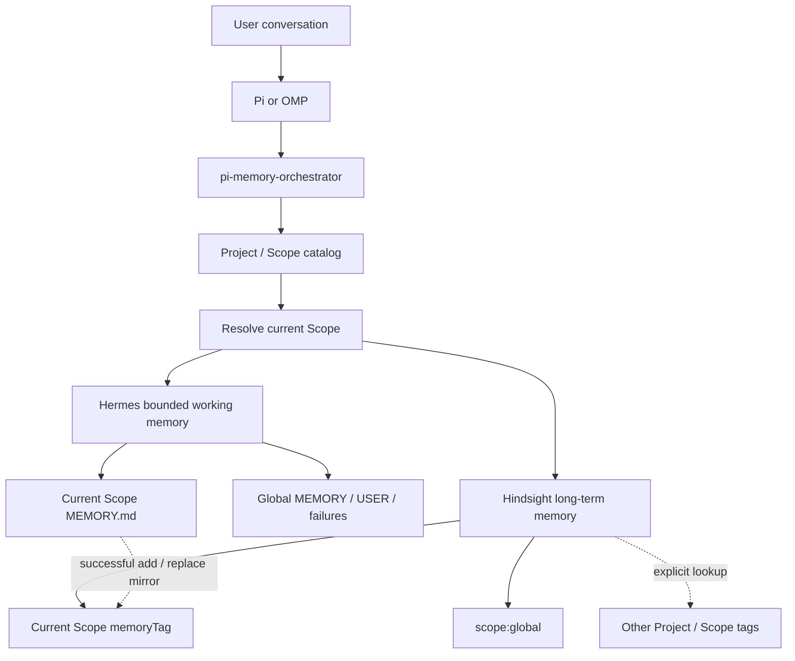
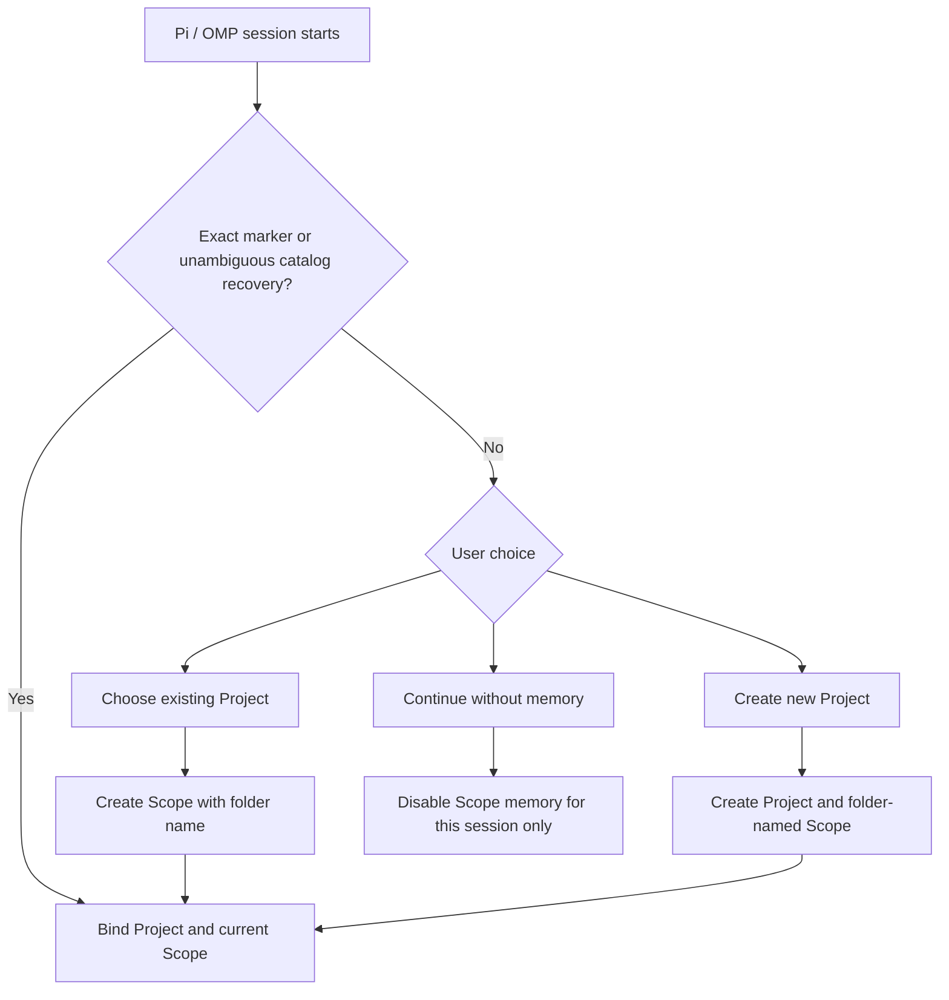
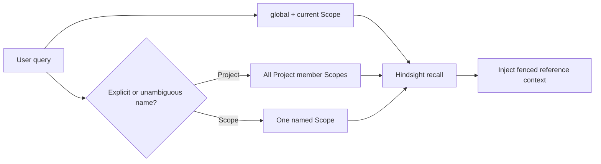
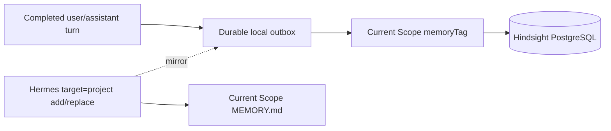

# pi-memory-orchestrator

Shared Project/Scope memory orchestration for Pi and OMP.

## Mental model



| Layer | Purpose | Mental model |
| --- | --- | --- |
| Pi/OMP session | Current conversation and compacted context | The desk in use now |
| Hermes | Small persistent context injected every session | Notes pinned above the desk |
| Hindsight | Large semantic, temporal long-term store | The archive |
| Project | Named group of related Scopes; owns no memory | A filing cabinet label |
| Scope | The only ordinary memory owner | One folder in the cabinet |
| Orchestrator | Resolves identity and routes reads/writes | The records clerk |

The active Hindsight bank is `coding-agent::dudong2`. Pi and OMP share the same catalog, bank, Hermes Markdown, SQLite mirror, and durable outbox.

## Project and Scope

A Project is a namespace for explicit cross-Scope lookup. It does not inherit from a parent directory and owns no Hindsight tag or Hermes memory.

A Scope belongs to at most one Project and owns:

- one stable `scopeId`;
- one Hindsight `memoryTag`;
- one Hermes working-memory directory;
- one local `.pi-memory-scope.json` marker.

The special global Scope belongs to no Project.

Current catalog shape:

| Project | Member Scopes |
| --- | --- |
| `LuckyCat` | `LuckyCat` |
| `auto-trading` | `auto-trading` |
| `automation` | `automation` |
| `cancel-ticket` | `cancel-ticket` |
| `certen-io` | `certen-io` |
| `character-ai-chat` | `ai-chat-engine` |
| `pi-memory-orchestrator` | `pi-memory-orchestrator` |
| `stablelabs` | `stable`, `stable-bft`, `stable-evm`, `stable-geth`, `stable-sdk` |

`stablelabs` demonstrates the intended relationship: five sibling repositories are independent Scopes in one Project. The parent `stablelabs/` directory is not a Scope and has no marker.

## Registration and startup



Resolution rules:

- Inside Git, only the Git repository-root marker is considered.
- Outside Git, only the exact launch-directory marker is considered.
- Filesystem ancestors are never inherited.
- A missing marker is restored only when repository or portable-path identity matches exactly one catalog Scope.
- When a repository gains its first canonical `origin`, its matching `local/...` identity is promoted without changing `scopeId` or memory. Existing canonical remote identities are never rewritten automatically.
- An unregistered location never creates a Scope automatically.
- A new Scope automatically uses the repository-root or registration-directory basename. The user is asked for a different name only when that Project already contains the same Scope name.

Choosing **continue without memory** creates no marker and no catalog suppression record. Hindsight Scope memory and Hermes Scope memory are disabled only for that session. A new session asks again.

## Stable identity and moves

The local marker stores identity, not memory or secrets:

```json
{
  "version": 2,
  "projectId": "project_...",
  "scopeId": "scope_...",
  "scopeName": "example",
  "kind": "repository"
}
```

Moving or renaming a marker-bearing directory preserves `scopeId`, Project membership, Hermes memory, and Hindsight memory. Only catalog paths are refreshed. Paths are recovery addresses, not hierarchy.

## Read path

Default recall is always:

```text
global OR current Scope
```

No parent, sibling, or entire Project is included implicitly.

Cross-Scope lookup is opt-in:

```text
project:stablelabs
scope:stablelabs/stable
```

- `project:stablelabs` adds all five member repository Scopes.
- `scope:stablelabs/stable` adds only `stable`.
- An unambiguous natural Project or qualified Scope name can expand the same way.
- Ambiguous names are not guessed; use an explicit selector.



## Write path

Every ordinary Hindsight write targets only the current Scope.



- `turn_end` retains the completed turn under the current Scope.
- `long_memory retain` always uses the current Scope.
- `long_memory correct` and `forget` operate on a returned memory ID.
- A successful Hermes `target=project` add/replace is mirrored into the same Hindsight Scope.
- The upstream Hermes API still calls the target `project`; the orchestrator binds it to the current Scope directory.

## Hermes: bounded working memory

Hermes is persistent but deliberately small. In `legacy-inject` mode, a frozen snapshot is loaded at session start and injected on every model request.

Global stores:

```text
~/.pi/agent/pi-hermes-memory/MEMORY.md
~/.pi/agent/pi-hermes-memory/USER.md
~/.pi/agent/pi-hermes-memory/failures.md
```

Current-Scope store:

```text
~/.pi/agent/projects-memory/<scopeId>/MEMORY.md
~/.pi/agent/projects-memory/<scopeId>/.pi-memory-scope-store.json
```

The metadata file maps the opaque stable ID to `Project/Scope` names. Name-based directories may remain for project skills, but they do not own Scope memory.

Hermes Markdown is authoritative. The searchable mirror is:

```text
~/.pi/agent/pi-hermes-memory/sessions.db
```

SQLite also indexes past sessions, but it is not the source of truth for working memory and can be rebuilt from Markdown.

## Hindsight: long-term memory

Hindsight stores documents, raw facts, temporal history, and consolidated observations in local PostgreSQL. Actual memory data lives in the shared bank and is isolated by each Scope's `memoryTag`.

Existing repository tags can remain stable across catalog migrations. New Scopes may use `scope:id:<scopeId>`. The catalog is the authority that maps human Project/Scope names to those tags.

OpenRouter receives only recall queries and reranking candidates. The authoritative database stays local.

## Durable outbox and failure behavior

```text
~/.local/share/pi-memory-orchestrator/outbox/
├── pending/
├── processing/
└── failed/
```

A turn is written to the local outbox before the Hindsight request. Operation IDs are deterministic and bank-scoped. Process exit, timeout, or temporary Hindsight failure therefore does not lose the write.

- Recall fails open: the agent continues without recalled context.
- Unfinished writes remain durable for another process.
- Hermes SQLite corruption does not destroy authoritative Markdown.
- With Hermes `projectResolutionMode: external`, a missing orchestrator response disables Scope memory instead of falling back to a cwd-derived project.

## Lifecycle

| Event | Action |
| --- | --- |
| `session_start` | Resolve/onboard Scope; bind Hermes; load bounded snapshot |
| `input` | Start speculative Hindsight recall |
| `before_agent_start` | Inject fenced recalled reference data |
| `tool_result` | Mirror successful bounded Scope-memory add/replace |
| `turn_end` | Enqueue the completed turn under the current Scope |
| `session_shutdown` | Bounded outbox drain; leave unfinished jobs durable |

## Knowledge UI

The Hindsight Knowledge tree mirrors the logical model:

```text
Coding Projects
├── Global knowledge
├── character-ai-chat
│   └── ai-chat-engine
└── stablelabs
    ├── stable
    ├── stable-bft
    ├── stable-evm
    ├── stable-geth
    └── stable-sdk
```

Each Scope page uses a strict tag filter. There is no filesystem-parent knowledge folder.

## Storage map

| Data | Location |
| --- | --- |
| Project/Scope catalog | `~/.local/share/pi-memory-orchestrator/scope-catalog.json` |
| Scope marker | `<registered-root>/.pi-memory-scope.json` |
| Hindsight retain queue | `~/.local/share/pi-memory-orchestrator/outbox/` |
| Hermes global working memory | `~/.pi/agent/pi-hermes-memory/` |
| Hermes Scope working memory | `~/.pi/agent/projects-memory/<scopeId>/` |
| Hermes search/session mirror | `~/.pi/agent/pi-hermes-memory/sessions.db` |
| Hindsight long-term data | local PostgreSQL, bank `coding-agent::dudong2` |

## Commands and tools

- `/memory-orchestrator-status`: current Project/Scope, bank, and outbox status.
- `/memory-find [name]`: read-only Project/Scope catalog lookup, grouped and sorted by Project; omit `name` to list the entire catalog.
- `/memory-reassign-scope [project]`: permanently move the current Scope to another Project while preserving its `scopeId` and `memoryTag`; without an argument, select the target interactively.
- `long_memory`: scoped Hindsight search, retain, correct, and forget.
- Hermes `memory_*` tools: bounded global/user/failure/current-Scope memory.

Project/Scope creation remains interactive. Scope reassignment requires an explicit confirmation and reloads the extensions after synchronizing the catalog, marker, Hermes metadata, and Hindsight Knowledge view.

## Hermes integration patch

`pi-hermes-memory@0.9.9` has no official external Scope resolver. This repository carries a narrow, version-checked event-bus patch:

```bash
node --import tsx scripts/install-pi-hermes-scope-hook.ts
```

The local Hermes config sets `projectResolutionMode` to `external`. A package update can overwrite the installed patch; revalidate the new package version and update or replace the patch rather than forcing the 0.9.9 diff onto another version.

## Configuration

Default file: `~/.config/pi-memory-orchestrator/config.json`.

```json
{
  "mode": "active",
  "bankId": "coding-agent::dudong2",
  "shadowBankId": "coding-agent::dudong2::shadow",
  "apiUrl": "http://127.0.0.1:18910",
  "requestTimeoutMs": 30000,
  "targetTimeoutMs": 5000,
  "maxRecallTokens": 4096,
  "recallTypes": ["observation"],
  "preferObservations": false,
  "dataDir": "~/.local/share/pi-memory-orchestrator",
  "markerName": ".pi-memory-scope.json"
}
```

The Hindsight API token is reused from `~/.hindsight/coding-agent.json`; do not duplicate it here.

## Verification

```bash
npm run check
npm test
```

Migration and rollback evidence lives under:

```text
~/.local/share/pi-memory-orchestrator/backups/
```

See `docs/explicit-project-scope-migration-20260916.md` for the live cutover record.
